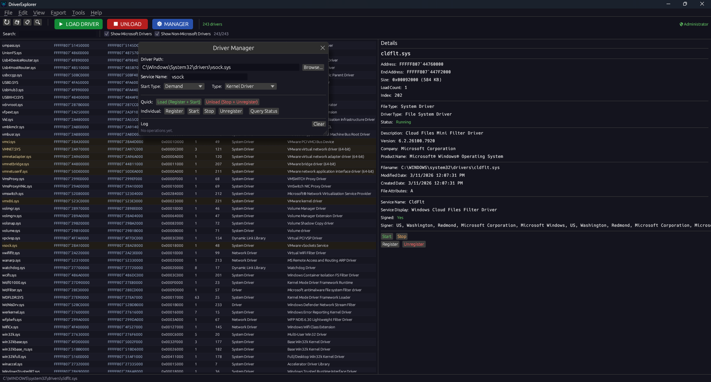

# DriverExplorer

A comprehensive Windows kernel driver analysis and management tool written in Rust. Combines real-time driver enumeration, digital signature verification, service control, and multi-format exports into a single lightweight (~4 MB) native binary with both GUI and CLI interfaces.




## Features

### Driver Analysis
- Enumerate all loaded kernel drivers via PSAPI and NtQuerySystemInformation
- 16-column sortable table: name, address, size, version, company, type, path, service name, signature status, and more
- Real digital signature verification using WinVerifyTrust and CryptCATAdmin (Authenticode + WHQL catalog, SHA256)
- File metadata extraction: version info, dates, attributes

### Driver Management
- Register, start, stop, and unregister drivers through the Windows Service Control Manager
- Configurable start type (Boot, System, Automatic, Demand, Disabled) and driver type
- UAC elevation via ShellExecuteW — no temp files written to disk
- Real-time service status queries

### GUI
- Dark-themed immediate-mode UI (egui/eframe)
- Multi-selection with Ctrl+Click, Shift+Click, and keyboard range selection
- Alt+key menu mnemonics, context menus, and full keyboard navigation
- Search and filter with Microsoft vs. non-Microsoft driver toggling
- Toolbar with prominent action buttons for driver operations

### Exports & Snapshots
- Export to CSV, JSON, HTML, and plain text (all or selected drivers)
- Save driver snapshots and compare against live state or previous baselines
- HTML diff reports showing added/removed drivers

### CLI
- 14 commands: `list`, `info`, `load`, `unload`, `start`, `stop`, `register`, `unregister`, `verify-signature`, `export`, `batch`, `snapshot`, `compare`

## Tech Stack

| Component | Technology |
|-----------|-----------|
| Language | Rust 2021 Edition |
| GUI | egui 0.31 / eframe 0.31 |
| Windows APIs | `windows` crate 0.62 (PSAPI, SCM, WinTrust, CryptCATAdmin, Registry, Shell) |
| CLI | clap 4.6 |
| Serialization | serde / serde_json |
| File Dialogs | rfd 0.15 |
| Build | winres (manifest + icon embedding), LTO-optimized release |

## Building

```bash
cargo build --release
```

Requires Windows and a Rust toolchain with the `x86_64-pc-windows-msvc` target.

## Usage

```bash
# Launch GUI
driverexplorer.exe

# List all drivers with signatures
driverexplorer.exe list --signatures

# Export to CSV
driverexplorer.exe export --format csv --output drivers.csv

# Load a driver
driverexplorer.exe load --path C:\path\to\driver.sys --service-name MyDriver

# Compare snapshots
driverexplorer.exe compare --baseline snapshot.json
```

## Keyboard Shortcuts

| Shortcut | Action |
|----------|--------|
| `Ctrl+F` | Find / search |
| `Ctrl+C` | Copy selected items |
| `Ctrl+A` | Select all |
| `Ctrl+D` | Deselect all |
| `Ctrl+S` | Save selected to file |
| `F5` | Refresh driver list |
| `F8` | File properties |
| `Up/Down` | Navigate table |
| `Shift+Up/Down` | Range selection |
| `Home/End` | Jump to first/last |
| `PageUp/PageDown` | Scroll by page |

## License
- Free for personal and non-commercial use.
- Commercial use requires a paid license.
